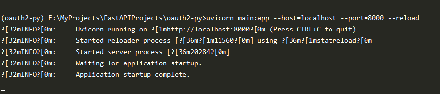
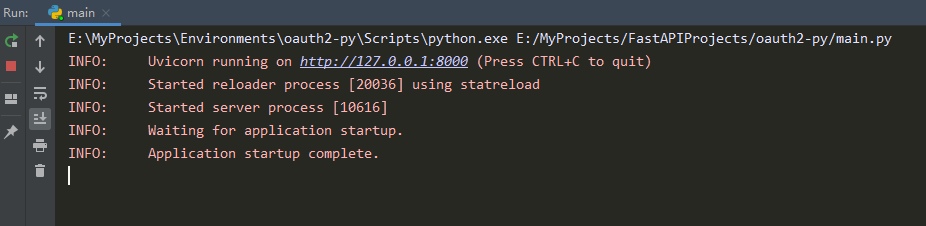
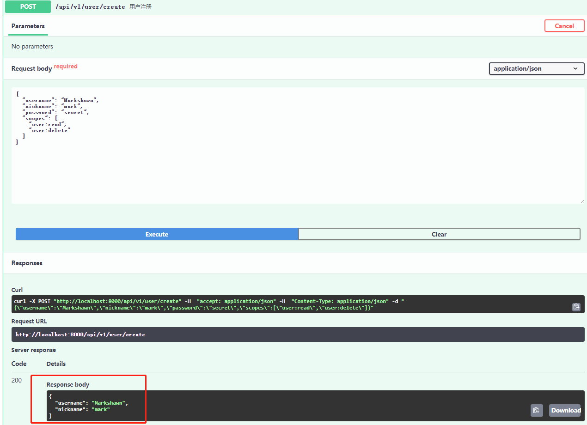
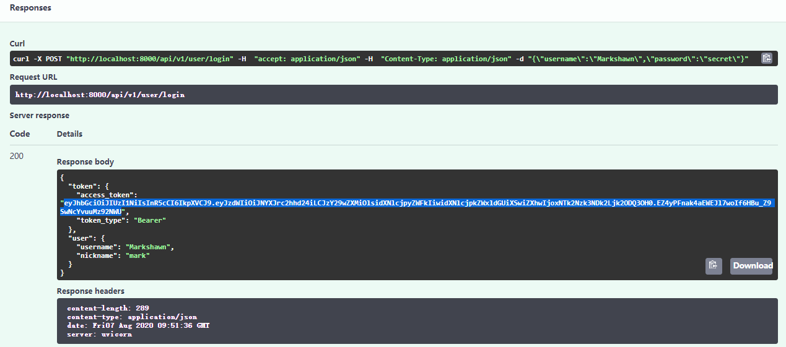
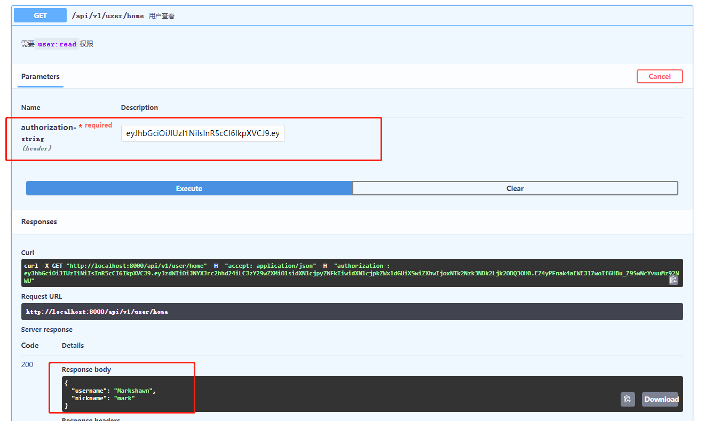
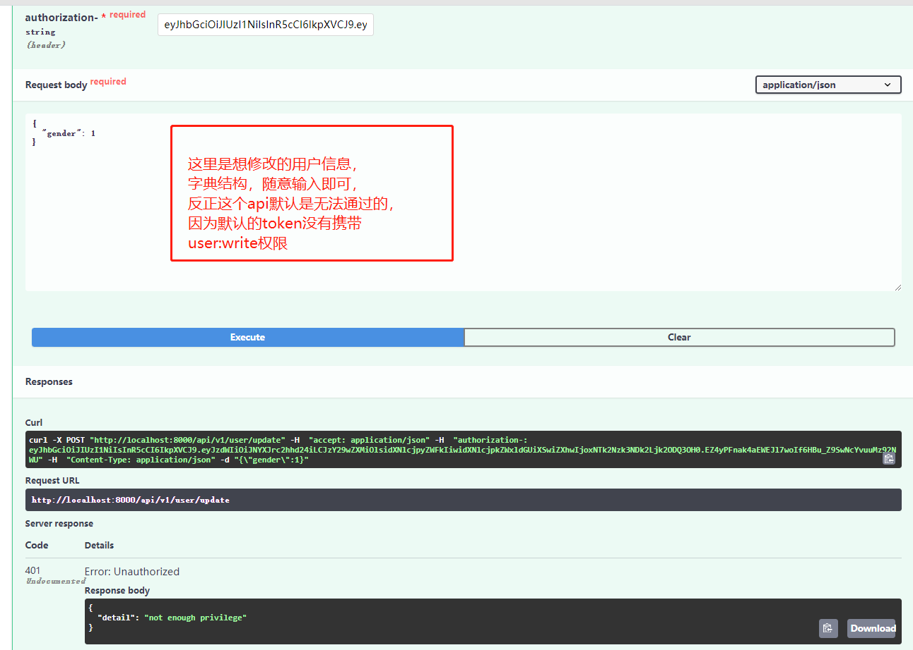
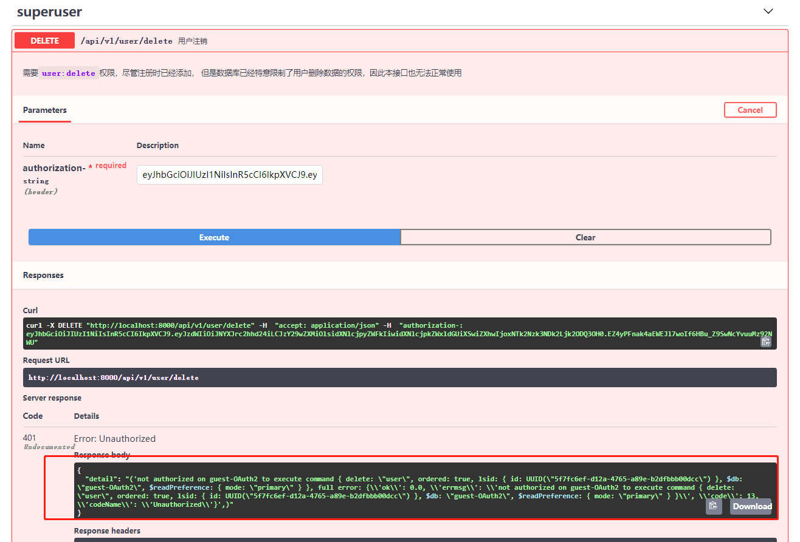

# 基于FastAPI的快速OAuth2实现

## 项目介绍

### 背景
本人最近在学习使用FastAPI搭建一些应用的后端框架，
FastAPI简单易用，性能强悍，因此使用体验还是较为良好的。

其中，官网的`Advanced Security`里讲到了基于`jwt`的`OAuth2`认证
（[FastAPI-OAuth2](https://fastapi.tiangolo.com/advanced/security/oauth2-scopes/)），
由于自身对鉴权系统的不够了解，再加上官网此处的写法十分高级与抽象，
因此耗费了大量的时间。

现在，基于我的研究，对作者的代码重新整理，降低其耦合度，
封装成了标准的可开箱即用的项目结构，供大家学习使用。

### 贡献
官网的教程，其实已经很详细了，相较于官网的示例，本项目有以下改进：
- 使用了基于装饰器（而非Depends）的访问权限控制，相较官网更易理解
- 对接了真实的数据库（我特设的数据库），可直接使用（求不攻击）
- 简单封装了CRUD的返回结果
- 独立出jwt、pwd两个模块，逻辑更清晰
- 参考作者的template，使用了model、crud、router的app结构

### 计划
企业的鉴权系统十分重要，但现在有很多开箱即用的成熟框架，
比如Spring体系中就也默认使用jwt的OAuth2系统，
在绝大多数情况下，已经能够满足企业级的使用需求，
无需投入更多精力，尤其是微服务应用中。

基于以上认知，该程序后续会进一步完善，
但没有太大意义去把它做成一个python专用的、更方便的认证系统。

本项目更适合希望使用python实现企业级认证系统的程序员研究使用，
更精确地说，是想使用FastAPI的。

### TODO
- ![ ] 新建user_v2的app，加入FastAPI内置的Bear认证，
以进一步提高OpenAPI的调试体验
- ![ ] 导入之前写好的mongo优化模块（解决_id问题）
- ![ ] 加入修改密码的测试

## 项目结构
```text
.
├── api
│   ├── __init__.py
│   ├── root_router.py  # 定义全局路由
│   └── user            # 可以理解为一个App
│       ├── __init__.py
│       ├── crud.py         # 后端数据库增删改查逻辑
│       ├── model.py        # 定义模型
│       └── router.py       # 链接模型、数据库的路由
├── database            # 数据库，默认使用mongodb
│   ├── __init__.py
│   ├── client.py           # 定义了数据库连接的后端
│   └── response.py         # 统一了数据库CRUD的返回结构
├── main.py             # 主程序，默认使用uvicorn启动
├── readme.md
├── settings.py         # 一些配置项
└── utils               
    ├── __init__.py
    ├── jwt.py          # jwt的签名与解析
    └── pwd.py          # 密码的哈希与还原
```

## 使用说明
### 推荐安装方式（使用虚拟环境）
```bash
pip install virtualenvwrapper
```

进入工作目录
```bash
git clone ...
cd oauth2-py
mkvirtualenv oauth2-py
pip install -r requirements.txt --ignore-installed
```

### 配置
### 修改你的用户信息
进入`settings.py`，修改`DefaultUser`下的信息字段，
尤其是`username`字段，该字段必须唯一，
否则注册时会显示注册失败，影响你的后续体验
### 修改你的秘钥
使用`openssl rand -hex 32`命令，生成你自己的`JWT_SK`秘钥，
该秘钥是`jwt`机制最重要的的保障，必须在服务端妥善存储，防止泄露。

生产环境中，要将秘钥写入环境变量中，而非源码里。

### 运行方法一（推荐）
在当前目录下，
```bash
uvicorn main:app --reload --host=localhost --port=8000 
```


### 运行方法二
直接运行`main.py`


### 访问OpenAPI
运行成功后，点击对应网址（默认：`http://127.0.0.1:8000）`，
在其后缀加上`/docs`，可访问到OpenAPI页面

## OpenAPI调试
### 本API结构
本API目前只包含一个独立的应用，即`user`，已经包含了如下功能：
- 用户注册（基于用户名、密码、昵称、权限参数）
- 用户登录（基于用户名、密码，得到token，然后基于token）
- 用户查看自己的信息（基于token，默认权限`user:read`）
- 用户修改自己的信息（基于token，默认权限`user:write`（注册时需要手动添加））
- 用户删除自己的信息（基于token，默认权限`user:delete`（后台已做限制））

### OpenAPI使用说明
> 图片链接在OpenAPI页面均是失效的，但可以去Github或Gitee浏览。
> - [Github链接](https://github.com/MarkShawn2020/oauth2-py)
> - [Gitee链接](ttps://gitee.com/MarkShawn2020/oauth2-py)

#### 1. 游客注册
点击`用户注册`，点击`Try it out`，修改输入框中的一些信息，
然后点击`Executive`。


#### 2. 使用用户名与密码进行登录
点击`用户登录`，其他同上，然后复制获得的`token`。


#### 3. 测试使用token进行用户访问
点击`用户查看`，将`token`复制到`authorization-`中，其他同上。

（注意，标准的请求头字段应该是`Authorization`，
这里主要是因为Swagger的一些系统原因，不得不改成一个别名，
详情参考：https/github.cotiangolfastapissue612）


#### 4. 测试使用token进行用户修改
点击`用户修改`，其他同上。
由于我在系统中对用户修改的api加入了`user:write`字段检验，
而注册时默认没有加入该字段，因此会返回权限不够的结果。

如果想让这个接口可以使用，重新注册一个账户，
并且在注册信息`scopes`字段中加入`user:write`。


#### 5. 测试使用token进行用户注销
点击`用户注销`，其他同上。返回结果如下，原因已经解释了。

综上，基于jwt、OAuth2、前端和后端，
可以实现非常复杂的鉴权系统，满足不同种业务的需求。


### OpenAPI简介
OpenAPI基于流行的SwaggerUI，用于快速生成项目的API前端展示系统，
方便程序开发人员与部分体验成员使用。
